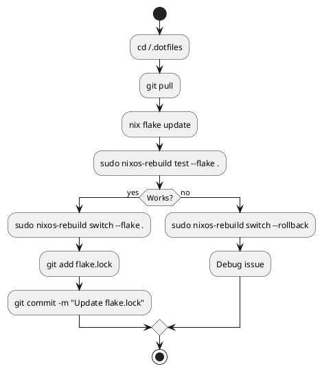

# Daily Operations

## Essential Commands

### System Management

```bash
# Rebuild and switch
sudo nixos-rebuild switch --flake .

# Test changes (rollback on reboot)
sudo nixos-rebuild test --flake .

# Build only (no activation)
sudo nixos-rebuild build --flake .

# Rollback to previous generation
sudo nixos-rebuild switch --rollback

# Update all flake inputs
nix flake update

# Update specific input
nix flake update nixpkgs

# Garbage collection
sudo nix-collect-garbage -d

# Keep only last 7 days
sudo nix-collect-garbage --delete-older-than 7d
```

### Information Commands

```bash
# Current hostname
hostname

# List generations
sudo nix-env --list-generations -p /nix/var/nix/profiles/system

# Show flake outputs
nix flake show

# Search packages
nix search nixpkgs firefox

# Check what would change
nixos-rebuild build --flake . && nvd diff /run/current-system result
```

## Common Workflows

### Update System



### Quick Package Test

```bash
# Test package without installing
nix shell nixpkgs#package-name

# Test with multiple packages
nix shell nixpkgs#ripgrep nixpkgs#fd

# Run command directly
nix run nixpkgs#cowsay -- "Hello"
```

## Troubleshooting

| Problem | Solution |
|---------|----------|
| Build fails | `sudo nixos-rebuild switch --flake . --show-trace` |
| Disk space | `sudo nix-collect-garbage -d` |
| Wrong host builds | Check `hostname`, use explicit: `--flake .#hostname` |
| Syntax errors | `nix flake check` |

## Shell Aliases

Add to your home.nix:

```nix
home.shellAliases = {
  rebuild = "sudo nixos-rebuild switch --flake ~/.dotfiles";
  update = "nix flake update";
  gc = "sudo nix-collect-garbage -d";
  search = "nix search nixpkgs";
};
```
