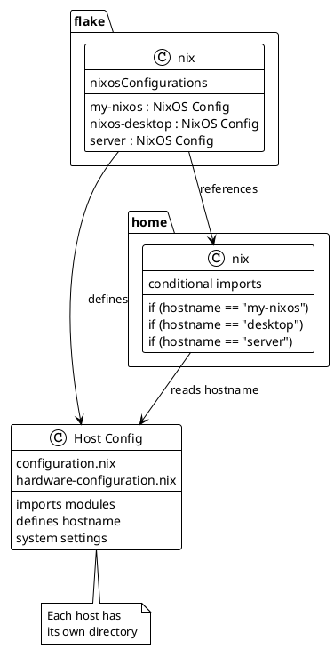

# Host Management

## Formula: Add New Host

### Step 1: Create Directory

```bash
mkdir -p hosts/HOSTNAME
```

### Step 2: Generate Hardware Config

On the target machine:

```bash
sudo nixos-generate-config --show-hardware-config > hosts/HOSTNAME/hardware-configuration.nix
```

### Step 3: Create Host Config

```nix
# hosts/HOSTNAME/configuration.nix
{ config, pkgs, inputs, ... }:
{
  imports = [
    ./hardware-configuration.nix
    ../../modules/wm/hyprland  # Add modules as needed
  ];

  networking.hostName = "HOSTNAME";  # MUST match directory name

  # Host-specific settings here

  # Standard boilerplate
  boot.loader.systemd-boot.enable = true;
  boot.loader.efi.canTouchEfiVariables = true;

  users.users.tai = {
    isNormalUser = true;
    extraGroups = [ "wheel" "networkmanager" ];
  };

  system.stateVersion = "25.05";
}
```

### Step 4: Update flake.nix

```nix
# Add to outputs.nixosConfigurations:
HOSTNAME = nixpkgs.lib.nixosSystem {
  system = "x86_64-linux";
  specialArgs = { inherit inputs; };
  modules = [
    ./hosts/HOSTNAME/configuration.nix
    home-manager.nixosModules.home-manager {
      home-manager.useGlobalPkgs = true;
      home-manager.useUserPackages = true;
      home-manager.extraSpecialArgs = { inherit inputs; };
      home-manager.users.tai = import ./home/tai/home.nix;
    }
  ];
};
```

### Step 5: Deploy

```bash
sudo nixos-rebuild switch --flake .#HOSTNAME
```

## Host Architecture



## Common Host Patterns

### Laptop

```nix
{
  # Power management
  services.tlp.enable = true;
  services.thermald.enable = true;

  # Touchpad
  services.libinput.enable = true;
  services.libinput.touchpad.naturalScrolling = true;

  # Brightness control
  programs.light.enable = true;
}
```

### Desktop

```nix
{
  # Graphics
  services.xserver.videoDrivers = [ "nvidia" ];
  hardware.nvidia.modesetting.enable = true;

  # Performance
  powerManagement.cpuFreqGovernor = "performance";

  # Gaming
  programs.steam.enable = true;
  hardware.opengl.driSupport32Bit = true;
}
```

### Server

```nix
{
  # No GUI
  services.xserver.enable = false;

  # SSH
  services.openssh.enable = true;
  services.openssh.settings.PermitRootLogin = "no";

  # Firewall
  networking.firewall.enable = true;
  networking.firewall.allowedTCPPorts = [ 22 80 443 ];
}
```

## Remote Deployment

```bash
# Deploy to remote host
nixos-rebuild switch --flake .#server \
  --target-host user@server.local \
  --use-remote-sudo

# Build locally, copy to remote
nixos-rebuild switch --flake .#server \
  --build-host localhost \
  --target-host user@server.local
```
