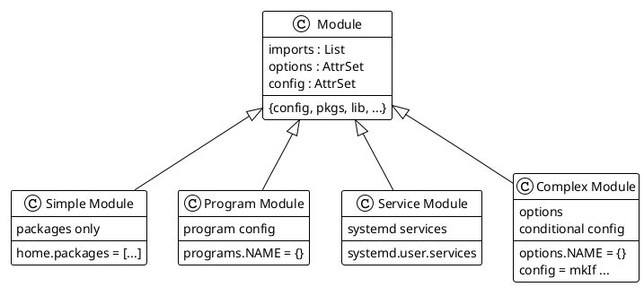

# Module Creation

## Module Structure



## Basic Module Template

```nix
# modules/CATEGORY/NAME/default.nix
{ config, pkgs, lib, ... }:

{
  # Module content here
}
```

## Module Types

### Type 1: Package Module

```nix
# modules/dev/web/default.nix
{ config, pkgs, lib, ... }:

{
  home.packages = with pkgs; [
    nodejs
    yarn
    httpie
    postman
  ];
}
```

### Type 2: Program Configuration

```nix
# modules/tui/zsh/default.nix
{ config, pkgs, lib, ... }:

{
  programs.zsh = {
    enable = true;
    enableCompletion = true;
    autosuggestion.enable = true;
    syntaxHighlighting.enable = true;

    oh-my-zsh = {
      enable = true;
      theme = "robbyrussell";
      plugins = [ "git" "docker" "kubectl" ];
    };

    shellAliases = {
      ll = "ls -la";
      gs = "git status";
    };
  };
}
```

### Type 3: Service Module

```nix
# modules/services/backup/default.nix
{ config, pkgs, lib, ... }:

{
  systemd.user.services.backup-docs = {
    Unit = {
      Description = "Backup documents";
      After = [ "network.target" ];
    };

    Service = {
      Type = "oneshot";
      ExecStart = "${pkgs.rsync}/bin/rsync -av ~/Documents/ /backup/docs/";
    };
  };

  systemd.user.timers.backup-docs = {
    Unit = {
      Description = "Backup documents daily";
    };

    Timer = {
      OnCalendar = "daily";
      Persistent = true;
    };

    Install = {
      WantedBy = [ "timers.target" ];
    };
  };
}
```

### Type 4: Module with Options

```nix
# modules/services/sync/default.nix
{ config, pkgs, lib, ... }:

with lib;

let
  cfg = config.services.mySync;
in
{
  options.services.mySync = {
    enable = mkEnableOption "my sync service";

    interval = mkOption {
      type = types.str;
      default = "hourly";
      description = "How often to sync";
    };

    source = mkOption {
      type = types.path;
      description = "Source directory";
    };

    destination = mkOption {
      type = types.path;
      description = "Destination directory";
    };
  };

  config = mkIf cfg.enable {
    systemd.user.services.my-sync = {
      Unit.Description = "Sync ${cfg.source} to ${cfg.destination}";

      Service = {
        Type = "oneshot";
        ExecStart = "${pkgs.rsync}/bin/rsync -av ${cfg.source}/ ${cfg.destination}/";
      };
    };

    systemd.user.timers.my-sync = {
      Unit.Description = "Run sync ${cfg.interval}";
      Timer.OnCalendar = cfg.interval;
      Install.WantedBy = [ "timers.target" ];
    };
  };
}
```

## Module Best Practices

### 1. Directory Structure

```bash
modules/
├── tui/
│   ├── nvim/
│   │   ├── default.nix    # Main config
│   │   ├── init.lua       # Neovim config
│   │   └── plugins.nix    # Plugin list
│   └── kitty/
│       └── default.nix
├── gui/
│   └── firefox/
│       ├── default.nix
│       └── policies.json  # Firefox policies
└── services/
    └── backup/
        └── default.nix
```

### 2. Conditional Imports

```nix
{ config, pkgs, lib, osConfig, ... }:

{
  imports = [ ]
    ++ lib.optional (osConfig.networking.hostName == "desktop") ./desktop.nix
    ++ lib.optional config.programs.hyprland.enable ./hyprland-integration.nix;
}
```

### 3. Module Composition

```nix
# modules/dev/full/default.nix
{ config, pkgs, lib, ... }:

{
  imports = [
    ../languages/python
    ../languages/rust
    ../languages/node
    ../tools/docker
    ../tools/git
  ];

  # Additional config for full dev setup
  home.packages = with pkgs; [
    lazygit
    lazydocker
  ];
}
```

### 4. System vs Home Modules

System module (requires sudo):

```nix
# modules/system/docker/default.nix
{ config, pkgs, ... }:

{
  virtualisation.docker.enable = true;
  users.users.tai.extraGroups = [ "docker" ];
}
```

Home module (user-level):

```nix
# modules/home/docker/default.nix
{ config, pkgs, ... }:

{
  home.packages = with pkgs; [
    docker-compose
    lazydocker
  ];

  home.shellAliases = {
    dc = "docker-compose";
    dps = "docker ps";
  };
}
```

## Testing Modules

```bash
# Test build with module
nix build .#homeConfigurations.tai.activationPackage

# Check module evaluation
nix eval .#homeConfigurations.tai.config.home.packages

# Isolated module test
nix repl
:l <nixpkgs>
:b (import ./modules/mymodule { inherit config pkgs lib; })
```
