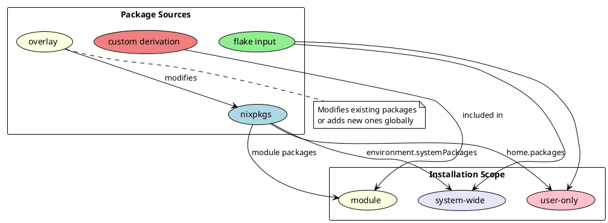

# Package Management

## Package Installation Methods



## Method 1: Direct Package Installation

### System-wide

```nix
# hosts/HOSTNAME/configuration.nix
environment.systemPackages = with pkgs; [
  firefox
  vim
  git
];
```

### User-only

```nix
# home/USERNAME/home.nix
home.packages = with pkgs; [
  discord
  spotify
  vscode
];
```

### In a Module

```nix
# modules/dev/tools/default.nix
{ config, pkgs, ... }:
{
  home.packages = with pkgs; [
    nodejs
    python3
    rustc
  ];
}
```

## Method 2: Flake Inputs

### Add to flake.nix

```nix
inputs = {
  nixpkgs.url = "github:NixOS/nixpkgs/nixos-unstable";

  # Add custom package flake
  zen-browser = {
    url = "github:youwen5/zen-browser-flake";
    inputs.nixpkgs.follows = "nixpkgs";
  };
};
```

### Use in Configuration

```nix
# Access via inputs
home.packages = [
  inputs.zen-browser.packages.${pkgs.system}.zen-browser
];
```

## Method 3: Overlays

### Create Overlay

```nix
# overlays/default.nix
final: prev: {
  # Add new package
  hello-custom = final.writeShellScriptBin "hello-custom" ''
    echo "Hello from overlay!"
  '';

  # Modify existing package
  firefox = prev.firefox.override {
    nativeMessagingHosts = [ final.passff-host ];
  };

  # Package with custom settings
  neovim-custom = prev.neovim.override {
    configure = {
      packages.myPlugins = with prev.vimPlugins; {
        start = [ telescope-nvim plenary-nvim ];
      };
    };
  };
}
```

### Apply Overlay

```nix
# In flake.nix
nixpkgs.overlays = [ (import ./overlays) ];

# Or in configuration.nix
nixpkgs.overlays = [
  (final: prev: {
    # Inline overlay
  })
];
```

## Method 4: Custom Derivations

### Simple Script

```nix
# modules/scripts/backup/default.nix
{ config, pkgs, ... }:
let
  backupScript = pkgs.writeShellScriptBin "backup-home" ''
    #!/usr/bin/env bash
    rsync -av --progress $HOME/ /backup/home/
    echo "Backup completed!"
  '';
in
{
  home.packages = [ backupScript ];
}
```

### Compiled Program

```nix
# modules/packages/my-app/default.nix
{ config, pkgs, ... }:
let
  myApp = pkgs.stdenv.mkDerivation rec {
    pname = "my-app";
    version = "1.0.0";

    src = ./src;  # or fetchFromGitHub

    buildInputs = with pkgs; [
      gcc
      cmake
    ];

    buildPhase = ''
      cmake .
      make
    '';

    installPhase = ''
      mkdir -p $out/bin
      cp my-app $out/bin/
    '';
  };
in
{
  home.packages = [ myApp ];
}
```

### Python Package

```nix
let
  myPythonApp = pkgs.python3Packages.buildPythonApplication {
    pname = "my-tool";
    version = "0.1.0";
    src = ./src;

    propagatedBuildInputs = with pkgs.python3Packages; [
      requests
      click
    ];
  };
in
{
  home.packages = [ myPythonApp ];
}
```

## Common Patterns

### Development Environment

```nix
# modules/dev/python/default.nix
{ config, pkgs, ... }:
let
  pythonEnv = pkgs.python3.withPackages (ps: with ps; [
    numpy
    pandas
    matplotlib
    jupyter
  ]);
in
{
  home.packages = [ pythonEnv ];
}
```

### Multiple Versions

```nix
{
  home.packages = with pkgs; [
    nodejs_18  # Specific version
    nodejs     # Latest

    (python39.withPackages (ps: [ ps.django ]))
    (python311.withPackages (ps: [ ps.flask ]))
  ];
}
```

### AppImage Packaging

```nix
let
  myAppImage = pkgs.appimageTools.wrapType2 {
    name = "obsidian";
    src = pkgs.fetchurl {
      url = "https://github.com/obsidianmd/obsidian-releases/releases/download/v1.4.16/Obsidian-1.4.16.AppImage";
      sha256 = "sha256-...";
    };
  };
in
{
  home.packages = [ myAppImage ];
}
```

## Quick Reference

| Task | Command |
|------|---------|
| Search packages | `nix search nixpkgs firefox` |
| Test package | `nix shell nixpkgs#package` |
| Show package info | `nix eval nixpkgs#package.meta.description` |
| Find package files | `nix build nixpkgs#package && ls result/` |
