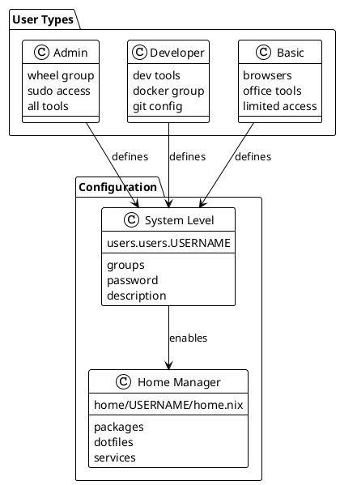

# User Management

## Formula: Add New User

### Step 1: Create User Directory

```bash
mkdir -p home/USERNAME
```

### Step 2: Create User Config

```nix
# home/USERNAME/home.nix
{ config, pkgs, inputs, ... }:
{
  home.username = "USERNAME";
  home.homeDirectory = "/home/USERNAME";

  imports = [
    # Add modules this user needs
    ../../modules/tui/cli-tools
    ../../modules/gui/browsers
  ];

  home.stateVersion = "25.05";
}
```

### Step 3: Add to Host Config

```nix
# hosts/HOSTNAME/configuration.nix
users.users.USERNAME = {
  isNormalUser = true;
  description = "Full Name";
  extraGroups = [ "networkmanager" ];  # Add groups as needed
  initialPassword = "changeme";  # Force change on first login
};
```

### Step 4: Update flake.nix

```nix
# For single user on host:
home-manager.users.USERNAME = import ./home/USERNAME/home.nix;

# For multiple users:
home-manager.users = {
  tai = import ./home/tai/home.nix;
  spouse = import ./home/spouse/home.nix;
  kid = import ./home/kid/home.nix;
};
```

## User Architecture



## Common User Patterns

### Admin User

```nix
# System level
users.users.admin = {
  isNormalUser = true;
  extraGroups = [ "wheel" "networkmanager" "docker" "libvirtd" ];
  openssh.authorizedKeys.keys = [ "ssh-rsa ..." ];
};

# Home level - unrestricted
imports = [
  ../../modules/dev
  ../../modules/admin-tools
  ../../modules/gui/all
];
```

### Developer User

```nix
# System level
users.users.dev = {
  isNormalUser = true;
  extraGroups = [ "networkmanager" "docker" ];
};

# Home level - dev tools only
imports = [
  ../../modules/dev
  ../../modules/tui/nvim
  ../../modules/tui/git
];
```

### Guest/Kid User

```nix
# System level
users.users.kid = {
  isNormalUser = true;
  extraGroups = [ "networkmanager" ];
};

# Home level - restricted
imports = [
  ../../modules/gui/browsers/firefox  # Specific browser
  ../../modules/gui/games/educational
];
```

## Shared Configuration

### Structure

```bash
home/
├── tai/home.nix
├── spouse/home.nix
└── shared/
    ├── base.nix      # Common for all users
    └── family.nix    # Family members only
```

### Usage

```nix
# home/shared/base.nix
{ config, pkgs, ... }:
{
  home.packages = with pkgs; [
    firefox
    vlc
  ];

  home.shellAliases = {
    ll = "ls -la";
  };
}

# home/tai/home.nix
imports = [
  ../shared/base.nix  # Include shared config
  # ... other modules
];
```

## Password Management

```nix
# Option 1: Initial password
initialPassword = "changeme";

# Option 2: Hashed password
hashedPassword = "$6$rounds=...";  # mkpasswd -m sha-512

# Option 3: No password (key-only)
openssh.authorizedKeys.keys = [ "ssh-rsa ..." ];

# Option 4: Password file (not in git)
passwordFile = "/etc/nixos/secrets/user.password";
```

## Per-Host Users

Your home.nix already supports this:

```nix
# Different modules load based on hostname
imports = [
  # Core modules
] ++ lib.optionals (hostname == "family-pc") [
  # Family PC specific
] ++ lib.optionals (hostname == "work-laptop") [
  # Work specific
];
```
